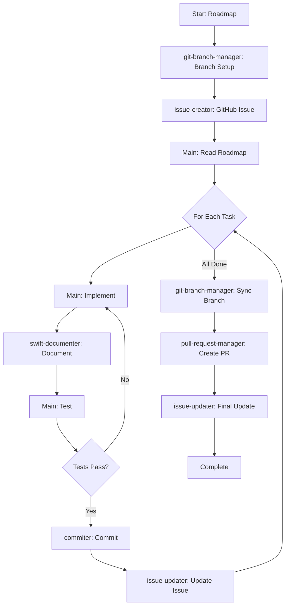

# Implement Roadmap with Agentic Workflow

## Usage

```txt
/implement-roadmap ISSUE_NUMBER
```

Where `ISSUE_NUMBER` is the GitHub issue number containing the roadmap tasks (e.g., `11`, `15`).

## Overview

This comprehensive roadmap implementation leverages specialized Claude Code agents for each phase of development,
ensuring better context management, task specialization, and quality control. The workflow orchestrates multiple
agents to implement complete roadmaps from start to finish.

## Implementation Phases

### Phase 1: Project Setup & Research

1. **Branch Management** - Use the **git-branch-manager agent** to handle branch operations:
   - Check current branch status
   - Create feature branch if needed: `roadmap/{roadmap-name}`
   - Ensure branch is properly tracked and pushed

2. **Issue Tracking** - Use the **issue-creator agent** to create GitHub issue for roadmap:
   - Creates structured issue with task breakdown
   - Provides sample implementations
   - Better tracking and visibility
   - Set up proper labels and milestones

3. **Research current implementation**:
   - Read the GitHub issue with roadmap tasks
   - Understand current status and next steps from issue description
   - Identify dependencies and impacts from issue technical details

### Phase 2: Implementation Cycle

For each uncompleted task in the roadmap:

1. **Mark task as in progress** by updating the GitHub issue with progress comments

2. **Implementation based on task type**:

   #### For Database/Migration Tasks

   - Implement SQL migrations in Palette target
   - Run `sqlfluff lint --dialect postgres .` and fix all issues
   - Update ERD with `./scripts/visualize-postgres.sh`
   
   #### For Service/API Tasks

   - Implement service layer code
   - Create/update DTOs and controllers
   - Update OpenAPI specifications
   
   #### For Frontend Tasks

   - Implement Elementary components
   - Add client-side validation
   - Update UI interactions

3. **Documentation** - Use the **swift-documenter agent** for comprehensive documentation:
   - Add comprehensive DocC comments to all public APIs
   - Include usage examples and parameter descriptions

4. **Testing Phase**:
   - Write Swift Testing tests (no XCTest)
   - **MANDATORY**: Run `swift test --no-parallel` and ensure ALL tests pass with exit code 0
   - **CRITICAL**: If tests fail or hang, fix all issues before proceeding

5. **Commit Management** - Use the **commiter agent** for commits:
   - Validates all changes and runs tests
   - Creates conventional commit with proper format
   - Returns commit SHA for tracking
   - Update roadmap with commit SHA

6. **Tracking Updates** - Use the **issue-updater agent** to update GitHub issue:
   - Updates issue with commit SHA
   - Mark task as completed with checkbox updates
   - Report progress status and link commits

### Phase 3: Quality Assurance

1. **Quality validation**:
   - Run `swift build` - no errors allowed
   - Run `swift test --no-parallel` - must exit with code 0
   - Run `./scripts/validate-markdown.sh --fix` on any markdown changes

2. **Branch synchronization** - Use the **git-branch-manager agent**:
   - Rebase on latest main if needed
   - Resolve any conflicts
   - Push updates to remote

### Phase 4: Pull Request

1. **PR Creation** - Use the **pull-request-manager agent**:
   - Verify all quality gates pass
   - Create comprehensive PR with roadmap linkage
   - Add appropriate labels and reviewers
   - Link to GitHub issue

2. **Final Updates**:
   - Use **issue-updater agent** to link PR to roadmap issue
   - Update issue status section with completion percentage
   - Note any remaining tasks in issue comments

## Agent Coordination Flow



## Quality Gates at Each Step

### Pre-Implementation Gates

- ✅ Branch created and pushed (git-branch-manager)
- ✅ GitHub issue created with tasks (issue-creator)
- ✅ Roadmap understood and current

### Per-Task Gates

- ✅ Implementation complete
- ✅ Documentation added (swift-documenter)
- ✅ Tests written and passing
- ✅ Commit created with SHA (commiter)
- ✅ Issue updated (issue-updater)

### Pre-PR Gates

- ✅ All tasks completed
- ✅ Branch synchronized (git-branch-manager)
- ✅ Full test suite passes
- ✅ Build has no errors
- ✅ Formatting validated

### PR Creation Gates

- ✅ PR created and linked (pull-request-manager)
- ✅ Issue updated with PR (issue-updater)
- ✅ All quality standards met

## Agent Usage Examples

### git-branch-manager for Branch Management

```bash
Use the git-branch-manager agent to create feature branch for AuthRoadmap implementation
```

### issue-creator for Issue Creation

```bash
Use the issue-creator agent to create GitHub issue for AuthRoadmap with sample implementations
```

### swift-documenter for Documentation

```bash
Use the swift-documenter agent to add DocC documentation for the new authentication service
```

### commiter for Commits

```bash
Use the commiter agent to create conventional commit for completed authentication tasks
```

### issue-updater for Updates

```bash
Use the issue-updater agent to update issue #123 with commit SHA abc123
```

### pull-request-manager for PR

```bash
Use the pull-request-manager agent to create pull request for completed AuthRoadmap implementation
```

## Benefits of Agentic Approach

1. **Context Preservation**: Each agent operates in its own context, preventing pollution
2. **Specialized Expertise**: Agents are optimized for their specific tasks
3. **Better Error Recovery**: Isolated contexts mean failures don't affect main thread
4. **Consistent Quality**: Each agent enforces its specific quality gates
5. **Improved Tracking**: Automatic updates to issues and roadmaps
6. **Parallel Processing**: Multiple agents can work on different aspects simultaneously

## Error Handling with Agents

If any agent fails:
1. The failure is isolated to that agent's context
2. Main thread remains clean for debugging
3. Can retry specific agent task without losing progress
4. Each agent provides specific error recovery steps

## Completion Criteria

The roadmap is complete when:
- ✅ All tasks checked in GitHub issue
- ✅ All commit SHAs recorded in issue comments
- ✅ GitHub issue shows 100% task completion
- ✅ PR is created and linked to issue
- ✅ All tests pass with exit code 0
- ✅ Build succeeds with no warnings

## CRITICAL REQUIREMENTS

- **NEVER** skip test verification at any step
- **ALWAYS** use agents for their specialized tasks
- **MANDATORY**: Every task must have a commit SHA recorded in the issue
- **CRITICAL**: Tests must pass before any commit
- **MANDATORY**: Run `swift test --no-parallel` after each step and after issue updates
- Each roadmap step gets its own commit (via commiter)
- Update GitHub issue with commit SHA after each step
- Continue until entire GitHub issue roadmap is completed

This agentic approach ensures higher quality, better tracking, and more reliable roadmap implementation
through specialized task delegation and isolated context management.


