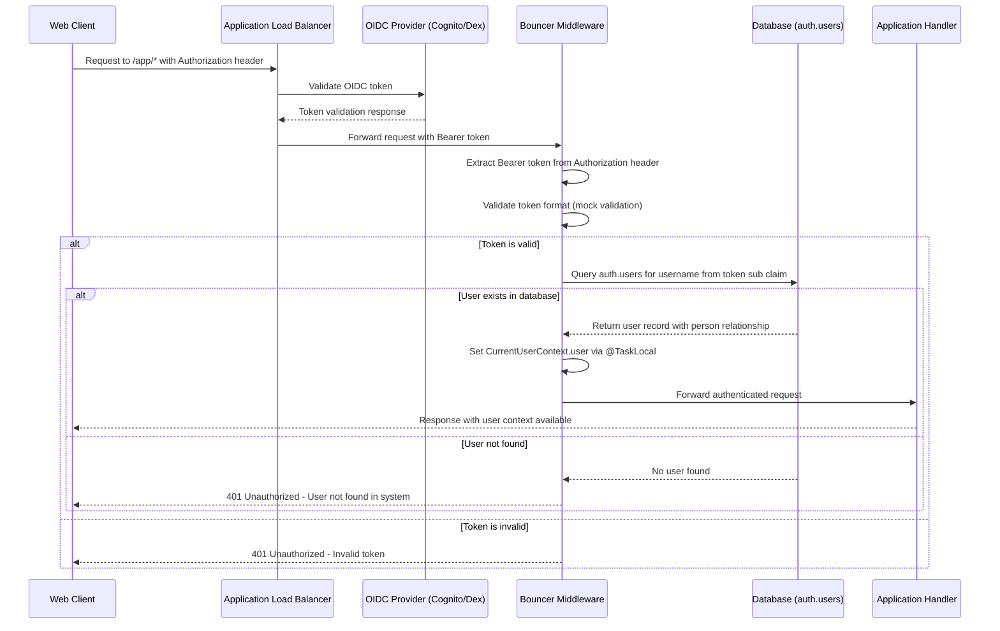

# Bouncer

Bouncer is the authentication middleware target for the Luxe monorepo. It provides
OIDC (OpenID Connect) authentication
middleware that validates JWT tokens and manages user sessions across all web
targets.

## OIDC Authentication Flow



## Key Security Requirements

1. **Pre-existing Users Only**: The system requires that users already exist in the
   `auth.users` table before they can
   authenticate. The middleware will NOT create new users automatically.

2. **Database Lookup**: For each authentication request, the middleware validates
   that the user's `sub` claim
   (username) exists in the database.

3. **Person Relationship**: Users are linked to `directory.people` records via the
   `person_id` foreign key, providing
   additional profile information.

## Usage

```swift
import Bouncer

// Configure OIDC
let config = OIDCConfiguration.create(from: app.environment)
let middleware = OIDCMiddleware(configuration: config)

// Add to route group
let protected = app.grouped(middleware)
protected.get("app", "me") { req in
    // Access current user via CurrentUserContext.user
    guard let user = CurrentUserContext.user else {
        throw Abort(.unauthorized)
    }
    return ["user_id": user.id]
}
```

## Current User Context

The middleware uses Swift's `@TaskLocal` to provide thread-safe access to the
current authenticated user throughout
the request lifecycle:

```swift
// Access current user anywhere in the request context
if let user = CurrentUserContext.user {
    // User is authenticated and available
}
```

## Database Schema

The authentication system requires you run `swift run Palette migrate` to create
the required tables.

## Environment Configuration

The middleware supports both production (AWS Cognito) and development (Dex)
environments:

**Production (Cognito):**

- `COGNITO_ISSUER`

- `COGNITO_CLIENT_ID`

- `COGNITO_JWKS_URL`

**Development (Dex):**

- `DEX_ISSUER`

- `DEX_CLIENT_ID`

- `DEX_JWKS_URL`

## Development Setup

### Quick Start

1. Start Dex: `docker-compose up -d dex`
2. Run setup: `./scripts/setup-dex.sh`
3. Test: <http://localhost:8080/app/me>

### Static Users

| Email | Password | Role |
|-------|----------|------|
| `admin@neonlaw.com` | Vegas702! | Admin |
| `teststaff@example.com` | Vegas702! | Staff |
| `testcustomer@example.com` | Vegas702! | Customer |

### Dex Endpoints

- **Discovery**: <http://localhost:2222/dex/.well-known/openid-configuration>
- **Authorization**: <http://localhost:2222/dex/auth>
- **JWKS**: <http://localhost:2222/dex/keys>

**Note**: Dex is for local development only. Production uses AWS Cognito.
